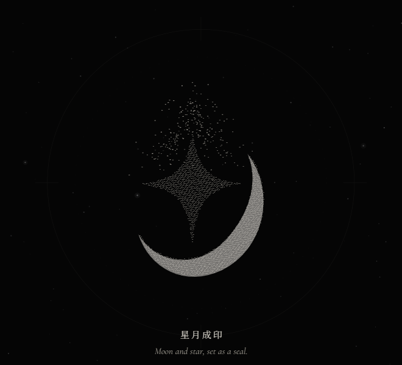
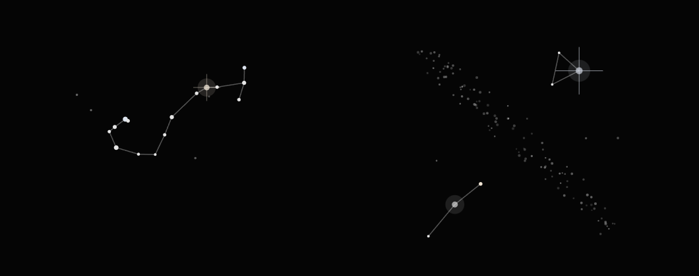
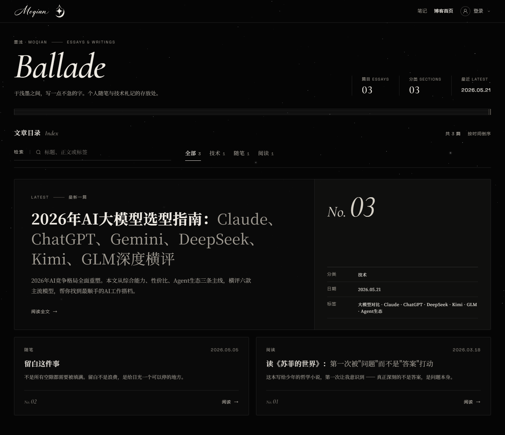
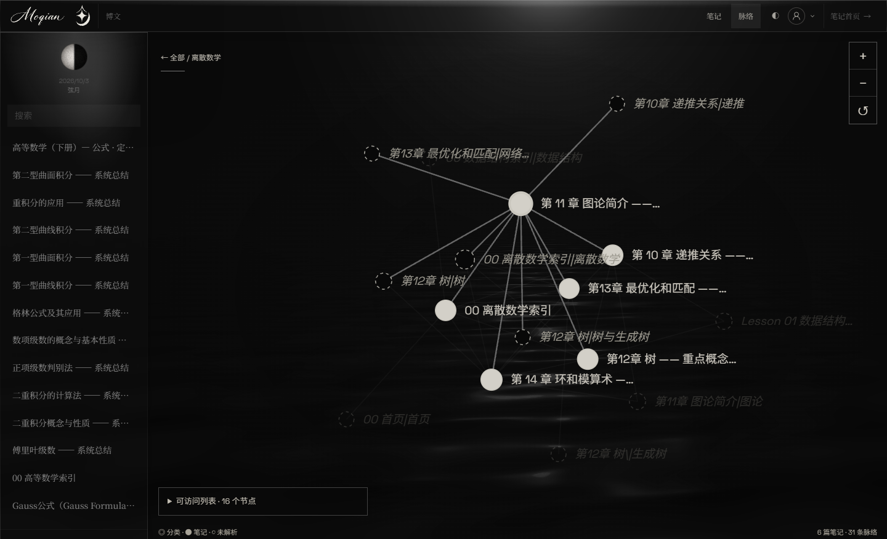
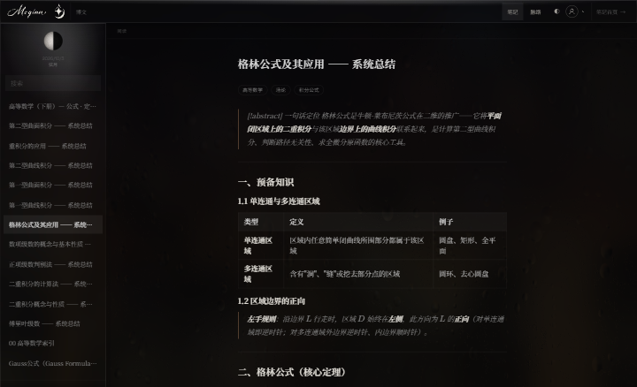

# 墨浅：一份写给自己的节目单

大学生活伊始，我就琢磨着做一个个人网站。想法很朴素：把写下的东西留下来，把想过的事情记下来，也把自己一点点长大的痕迹存起来。后来它慢慢有了名字，叫墨浅（Moqian）；也慢慢有了样子：一页深色的、安静的网页，读起来像在微光里翻一页纸。

这篇文章不讲怎么部署，也不列技术清单，只想以设计者的身份，聊聊这座小站的每一处为什么是现在这个样子。

> 它不是简历，也不是频道，只是一个安放真实内心的小角落。

#### 一份节目单

我喜欢音乐，所以从一开始就想让网站读起来像一份音乐会的节目单。拿到节目单的人，会先看见演出的名字，再看见一串乐章，乐谱则安静地放在一旁。墨浅的结构就照着这个样子来排：

- **Prelude**，序曲，即首屏，由星河、月相与星月成印三个乐章组成；
- **Now / About**，讲我是谁、这里是什么；
- **Ballade**，叙事曲，是成篇的博文——也就是你现在读的地方；
- **Opus**，作品集，已完成的个人作品叫 Sonata，正在进行的叫 Concerto；
- **Étude**，练习曲，是课程笔记和推导练习；
- **留言簿**，留给来访的人；
- **Coda**，尾声，是页脚。

名字一旦定下，很多细节就顺理成章了。节标题写成 `03 —— 作品 · SELECTED WORKS` 的样式，列表前缀是 `01 02 03`，博客的期号是 `No. 03`，都是节目单的口吻。

每个栏目的角落还放着一段真实乐谱的剪影，分别出自贝多芬、肖邦和李斯特：About 是贝多芬的《月光奏鸣曲》，Ballade 是肖邦的《第一叙事曲》，Opus 是李斯特的《第二匈牙利狂想曲》，Étude 和留言簿则是肖邦的《黑键练习曲》与《幻想即兴曲》。五线谱和音符被拆成两层半透明的画面，不透明度只有一成多，进入视口时从角落向中心轻轻扫入。它们不需要被认真看，只要在余光里存在就好。

就连文章列表还没加载完、或者暂时空着的时候，我也没有放一个转圈的 loading，而是写上「Intermission · 幕间 —— 文章正在后台调音，稍候登场」。等待，本来也是剧场体验的一部分。

#### 只用灰阶

配色是我最早定下、也守得最固执的一条规矩：**整站只用灰阶，不用强调色。**

底色是近乎纯黑的 `#050505`，前景不是冷白，而是微微偏暖的 `#E9E6DF`。我给自己的解释是：文字和月光应该来自同一个光源，所以前景永远不该退回冷冰冰的灰白。需要强调时，就沿着灰阶往上走——dim、muted、fg，最后才是纯白，而纯白只留给鼠标悬停的那一刻。

不用颜色之后，层次只能交给别的东西：字号、字重、行距，以及 1px 的细线。所以墨浅几乎没有阴影，也基本不用圆角，栏目之间只靠一根 `#1A1A1A` 的细线隔开。可读性也有底线：需要阅读的文字最暗只到 `#8C8A85`，再暗的灰只做装饰，不承载任何信息。

规矩也留了几处小小的例外。笔记站里的 wiki 链接和引用线用了暖铜色，因为在密集的推导里，链接需要被一眼找到；留言簿的错误提示是暗红色；Google 登录图标保留它自己的颜色。例外很少，每一处都有它的理由。

#### 六种字体，各司其职

颜色退场之后，字体就得多担一些。墨浅一共用了六种字体，各有分工：

| 用途 | 字体 |
| --- | --- |
| 字标 | Great Vibes，英文手写体，用于顶栏与页脚，悬停时会描边重写一遍 |
| 书法 | Ma Shan Zheng，只取「墨」「浅」两个字 |
| 展示 | Cormorant Garamond 斜体，用于栏目名 |
| 正文 | Noto Serif SC，行高 1.9 |
| 文楷 | LXGW WenKai，用于页脚标语和引文 |
| 标记 | Space Grotesk，用于日期、计数、序号 |

正文选衬线体，是因为我希望这里读起来更像书，而不像界面；日期和序号这类元信息则用小号的无衬线字体，拉开字距，像乐谱边上的小注。首屏那两个大字「墨浅」用的是书法字体，但我只裁出了这两个字的子集——为两个字加载一整套字库，不值得。

#### 序曲：星河、月相与成印

首屏是我花时间最多的地方。右边是一团粒子，桌面上有两千多颗，手机上减到八百颗。粒子不是简单的模糊光点，它们的纹理取自一张画着 `·`、`−`、`~`、`+` 四个字符的贴图——终端字符画的质朴和三维粒子的光亮，就这样织在了一起。

它有三种形态，我把它们当作序曲的三个乐章。

第一乐章是**星河**。一小部分粒子聚成核心，大部分沿两条对数螺线铺成旋臂，其余散在外围，配文是「星河缓行，归于月华」。

第二乐章是**月相**。粒子收拢成一颗点阵球面，缓缓自转，背光的一侧暗下去；鼠标靠近时，粒子会被轻轻推开。这一幕的配文是「月光落下，序曲将起」，这篇文章的封面就是它。

第三乐章是**星月成印**。粒子从月亮里散开，重新聚成墨浅的图形标：底下一弯新月，中间一颗四芒星，顶上一道光芒。

这一步改了很多次。最早每颗粒子都飞向一个随机的目标点，结果过渡到一半，整个球面散成一团雾，什么形状都看不出来。后来我改成「就近归位」：按球面上的投影，让每颗粒子去找离自己最近的那个点。于是你会看到，球面先滑成一弯新月，星从中心凝出来，光芒最后沿着中轴落下。形状的诞生有了先后，不再凭空浮现。

成印时的布点也反复调过。规则点阵太像机器，随机散点又容易扎堆。最后用了一种疏密均匀、却不排成格子的取样方式，再给每个点一点大小差异和月面式的明暗——左上亮，右下暗，各自轻轻闪烁。

粒子成形之后，实心的图形标按「月托星升」的顺序接替上场：先是新月，再是星，最后是光芒，前后 1650 毫秒，粒子随即退场。这个顺序也是 Logo 本身的寓意——月亮在下面托着，星星才升得起来。

#### 指尖的星座

序曲之外，我还在整个网站里藏了一个小小的点击特效：在电脑上用鼠标点一下页面任意空白处，落点就会亮起一个星座。

这些星座不是随手画的。每颗星都按真实的赤经、赤纬和星等录入，再投影到平面上，北在上、东在左，与抬头看天时的方向一致。星等决定大小，越亮的星画得越大；有几颗星还带着淡淡的色调，心宿二、参宿四偏暖，织女一、参宿七偏冷。这是我在灰阶规矩里偷偷放进去的一点温度，淡到几乎看不出来，但真实的星空本来就是这样。

常驻的星座有十个：北斗七星、仙后座、南十字、天鹅座、猎户座、天琴座、天蝎座、狮子座、小熊座和双子座。它们放在一个「洗牌袋」里轮流出场，一轮之内不会重复，新一轮也不会以上一轮的最后一个开头，所以连点几下，看到的总是不同的星空。

一次点击大约持续两秒，我把它当成一小段乐句来编排：落点先亮起一圈细细的闪光；接着星星由近及远，沿一道弧线旋进各自的位置；然后连线按长短依次描出，线头带着一点光；连好之后，最亮的那颗星闪一下，长出十字形的星芒；最后整组星散成星尘，拖着短短的尾巴向外漂远，慢慢淡去。每次的角度和大小都略有不同，周围还会撒几颗不连线的背景星，像从夜空里剪下来的一小块。

剩下的交给运气。大约每八次点击，会有一颗流星从旁边划过；大约每十二次，出现的不是常驻星座，而是彩蛋：一簇不连线的昴星团，或者隔着一道淡淡银河相望的牛郎与织女。

这个特效也有它的分寸：屏幕上最多同时留四个星座，没有星座时绘制循环完全停下，不占一点开销；它只响应鼠标左键，在输入框里打字时不会触发，触屏设备和开启减少动效时也不出现。它对读屏软件是隐藏的，因为它只是装饰，不该打扰任何人。

#### 动效的克制

做了这么多动效，我反而更在意它们什么时候应该停下来。

墨浅会跟随系统的「减少动效」设置；就算系统没开，也可以在页脚手动关掉。关掉之后一切都是静态的，连 WebGL 都不会加载。设备带不动时，会先减少粒子、降低分辨率，还不行就退回到 ASCII 字符画的月亮和一张静态的星系图。页面切到后台，或者首屏滚出视口时，渲染都会暂停。我不希望一个安静的网站，在别人看不见的地方悄悄发烫。

前面写到的点击星座也是如此：三个站点都有，但只在需要的时候出现，用完就安静下来。

#### 三个站点，一套语言

墨浅其实由三个站点组成：主页、博客和笔记。它们各自独立构建、独立部署，但共用同一套设计规范，字标、星月、星空背景这些组件也是同一份。

**博客 Ballade** 是读文章的地方。首页上最新的一篇独占一张宽卡片，其余文章两列排开，可以搜索，也可以按分类筛选。文章页是单栏，最宽 720px——这是我觉得中文读起来最舒服的宽度。公式用 KaTeX 渲染，文章之间可以用 `[[双链]]` 互相引用，也提供 RSS。站里还内置了一个写作编辑器，Markdown 与预览并排，光标走到哪里，预览就跟到哪里。

**笔记 Étude** 放在 note.moqian.me，收着我在 Obsidian 里写的课程笔记。桌面上会先进入一张分类图谱：实心圆是已经写下的笔记，虚线圆是链接到了、却还没写的那一篇。我很喜欢这些虚线圆，它们像练习曲里还没弹到的小节，提醒我知识的边界在哪里。侧栏顶上有一轮月相，按当天的日期算出，所以每天打开都略有不同。

笔记站是整套灰阶里唯一允许自己多一点情绪的地方。右上角可以切换四种背景：默认的月夜是一片泛着涟漪的水面，此外还有丝流、雨窗，以及墨色、靛蓝、松绿这些纯色。长时间推导公式的时候，换一扇下雨的窗，心会静一些。

#### 写作这件事本身

网站搭好了，最重要的还是往里面写东西，所以我也花了些心思，让「写」这件事尽量轻。

我在 Obsidian 里写作，一篇文章就是一个文件夹：正文是 `index.md`，配图放在同一个文件夹里。写好之后，在站点的上传页选中这个文件夹，文章就发布出去了，不必为每一篇重新构建整个网站。标题就是正文第一行，分类在上传时填写，日期决定它能不能出现在主页最新的三篇里。

首页的留言簿也是同样的想法：不登录也能读，登录后可以留下一段不超过五百字的纯文本。它很简单，只是希望来过的人，能留下一句话。

#### 尾声

页脚写着四个字：静水深流。这是我给墨浅定下的调子，也是我对自己的期望——表面安静一点，底下慢慢流动，一直向前。

Now 一节里我的署名是 Y.I.A.，它会在缩写、拼音和含义之间循环变换。含义是 Yearning · Ingenious · Astute：有所向往，心思灵巧，目光敏锐。这三个词与其说是在形容我，不如说是我想成为的样子。

墨浅还会继续写下去。序曲已经奏完，接下来是正曲。

期待与你在更美好的未来相见。
